# Kibana Cheatsheet
---

## Kibana Index Pattern and Discover Tab
__Dataset : [Books](dataset/books.ndjson)__

__Objectives :__

- Load data into elasticsearch through kibana.
- Modify the default `data view` (new name for index template).
- Format data display using the discovery tab.
- Perform various serarches.

__Steps :__

1. Download dataset
2. Upload dataset into kibana.
3. Before import the dataset, please change the mapping properties for each `Authors` and `Book` field to `text` and `keyword`
   ```json
   "field-name": {
      "type": "text",
      "fields": {
          "keyword": {
            "type":  "keyword"
          }
        }
    }
    ```
4. And change the mapping properties for `yearFirstPublished` to `date` with date format `yyyy`
   ```json
   "field": {
      "type": "date"
   }
   ```
5. Once the dataset is created in kibana we can modify the data view:
   - Set a custom format for the `yearFirstPublished` field (YYYY).
   - Create a scripted field to google search the books title
      - URL template = https://www.google.com.au/search?q={{value}}
      - script = doc['Book.keyword'].value
6. Open the dataset in the discover tab - note the impact of the data view changes we made - i.e. additional fields.


## Visualizations
### Earthquake Visualization
#### Import the dataset
__Dataset : [Earthquakes](dataset/earthquakes.csv)__

__Steps :__
1. Download dataset file from the dataset folder in this repo.
2. Login to kibana and click the __Machine Learning -> Data Visualizer -> Import Data__ and then select the dataset.
3. Upload dataset into kibana. The wizard will show __File contents__, __Summary__, and __File stats__ and click import.
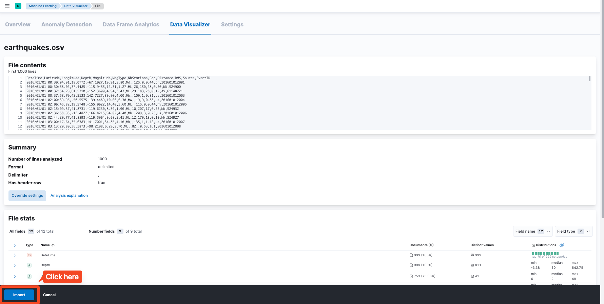
4. Fill the __index name__, __index pattern name__, and then update the index mapping with [earthquakes-mapping](dataset/earthquakes-mapping.json)
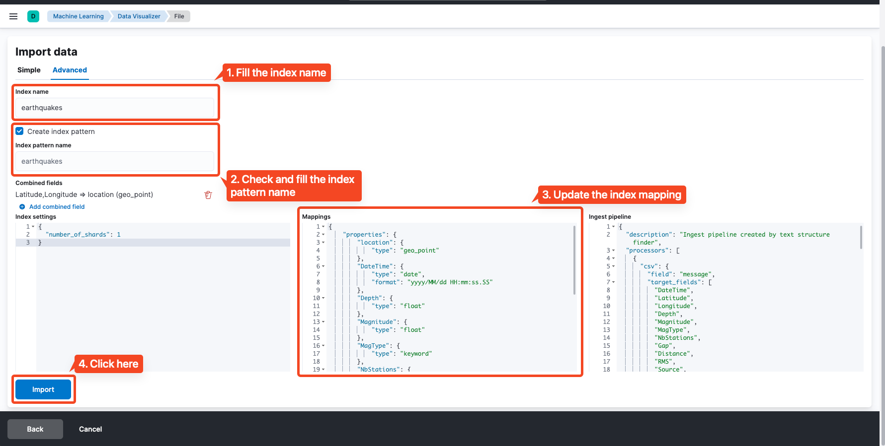
5. Once the dataset is created in kibana, we can check it in __Stack Management -> Index Management__.
6. Make sure the created index name was exists.
---
#### Count by Magnitude (Aggregation Vertical Bar)
Create visualization related daily earthquake count based on magnitude.

__Steps :__
1. Go to __Visualize Library -> Create visualization__ and select __Aggregation based -> Vertical bar__, and then choose the index.
2. For __Metrics Y-axis__, fill the requirement with this value :
   - __Aggregation__ : `Count`
   - __Custom label__ : `Count by Magnitude`
3. For __Buckets__, add this parameter :
   - __X-axis__
     - __Aggregation__: `Date Histogram`
     - __Field__ : `DateTime`
     - __Minimum interval__ : `Day`
     - __Custom label__ : `Daily`
   - __Split series__
     - __Sub aggregation__ : `Range`
     - __Field__ : `Magnitude`
     - __Range__ :
       - `≥ 0 < 1`
       - `≥ 1 < 2`
       - `≥ 2 < 3`
       - `≥ 3 < 4`
       - `≥ 4 < 5`
       - `≥ 5 < 6`
       - `≥ 6 < 7`
       - `≥ 7 < 8`
       - `≥ 8`
4. Save the created visualization into library.
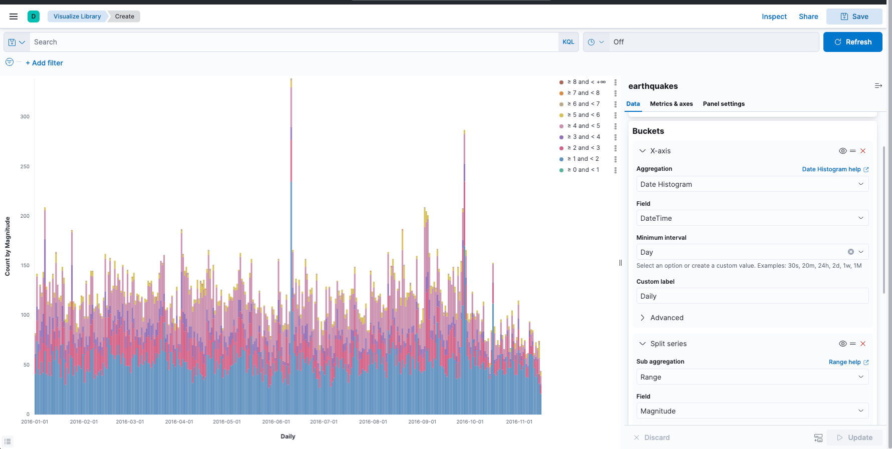
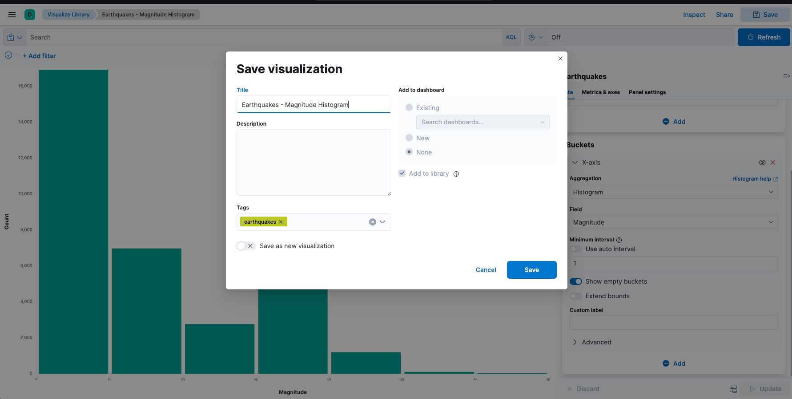
---
#### Magnitude Histogram (Aggregation Vertical Bar)
Create visualization related magnitude histogram.

__Steps :__
1. Go to __Visualize Library -> Create visualization__ and select __Aggregation based -> Vertical bar__, and then choose the index.
2. For __Metrics Y-axis__, fill the requirement with this value :
   - __Aggregation__ : `Count`
3. For __Buckets__, add this parameter :
   - __X-axis__
     - __Aggregation__: `Histogram`
     - __Field__ : `Magnitude`
     - __Minimum interval__ : `1`
4. Save the created visualization into library.
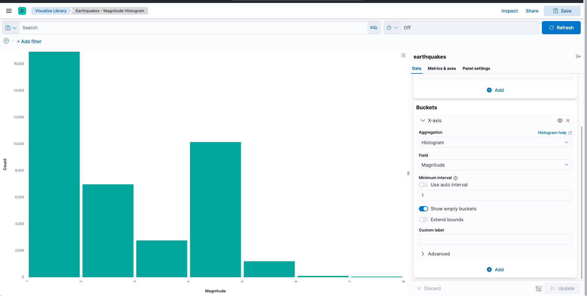
---
#### Earthquake Count (Aggregation Metric)
Create visualization related total eartquake.

__Steps :__
1. Go to __Visualize Library -> Create visualization__ and select __Aggregation based -> Metric__, and then choose the index.
2. For __Metrics__ data, fill the requirement with this value :
   - __Metric__
     - __Aggregation__ : `Count`
     - __Custom label__ : `Earthquake Count`
3. Save the created visualization into library.

---
#### Average Depth (Aggregation Metric)
Create visualization related average eartquake depth.

__Steps :__
1. Go to __Visualize Library -> Create visualization__ and select __Aggregation based -> Metric__, and then choose the index.
2. For __Metrics__ data, fill the requirement with this value :
   - __Metric__
     - __Aggregation__ : `Average`
     - __Field__ : `Depth`
     - __Custom label__ : `Average Depth (km)`
3. Save the created visualization into library.
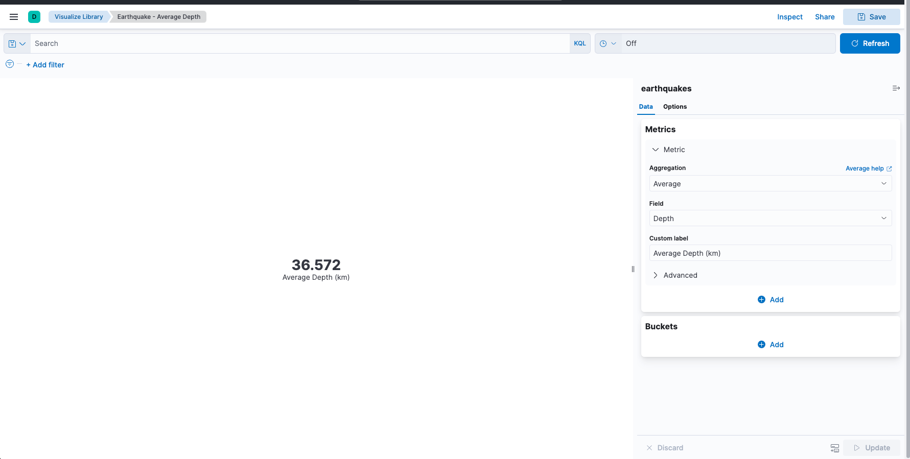
---
#### Max Magnitude (Aggregation Metric)
Create visualization related average eartquake depth.

__Steps :__
1. Go to __Visualize Library -> Create visualization__ and select __Aggregation based -> Metric__, and then choose the index.
2. For __Metrics__ data, fill the requirement with this value :
   - __Metric__
     - __Aggregation__ : `Max`
     - __Field__ : `Magnitude`
3. Save the created visualization into library.

---
#### Max Magnitude Map (Aggregation Metric)
Create map visualization related max magnitude.

__Steps :__
1. Go to __Visualize Library -> Create visualization__ and select __Maps__.
2. Click `Add layer` and select `Heat map`.
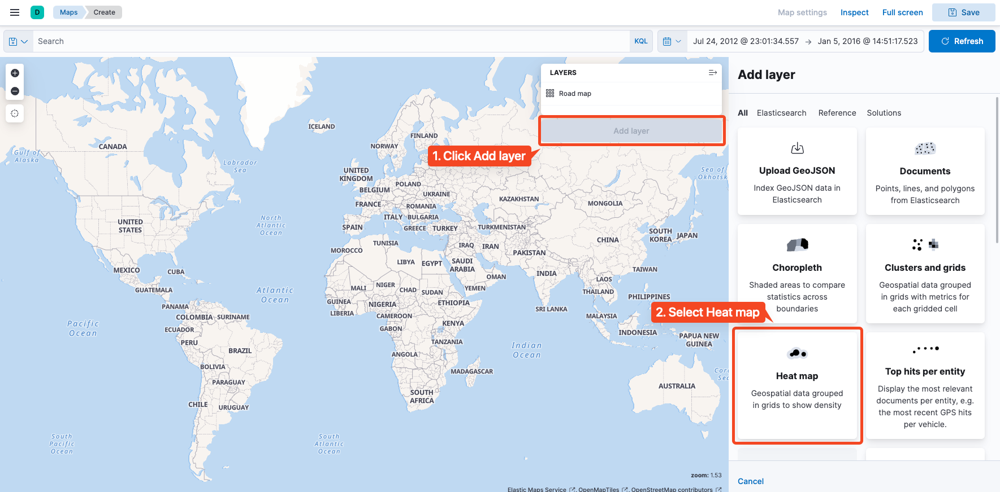
3. Select __index pattern__ and __Geospatial field__.
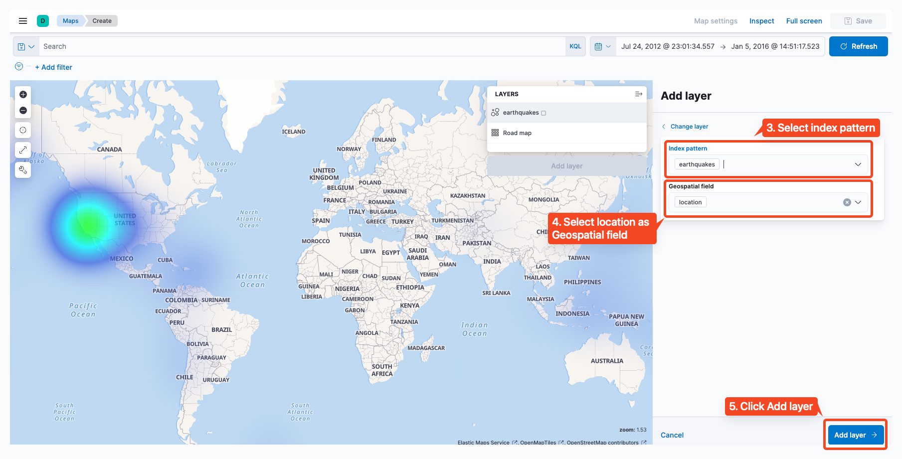
4. Save the created visualization into library.
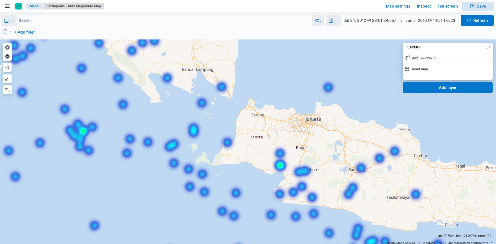
---

## Dashboard
### Earthquake Dashboard
#### Create dashboard
__Steps :__
1. Go to __Dashboard__ and click __Create dashboard__.
2. Click __Add from library__ and then select one of the visuals from library.
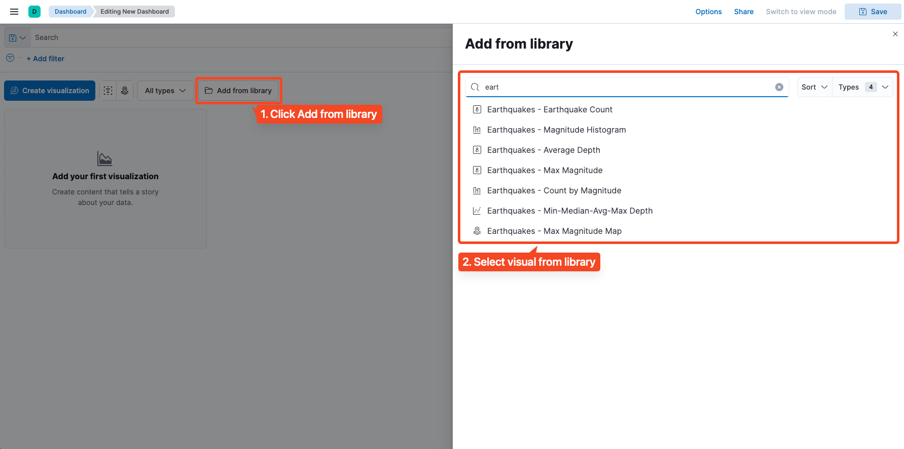
3. You can set the visual according your preferences.
4. Repeat step 1-3 until you finish create the dashboard.
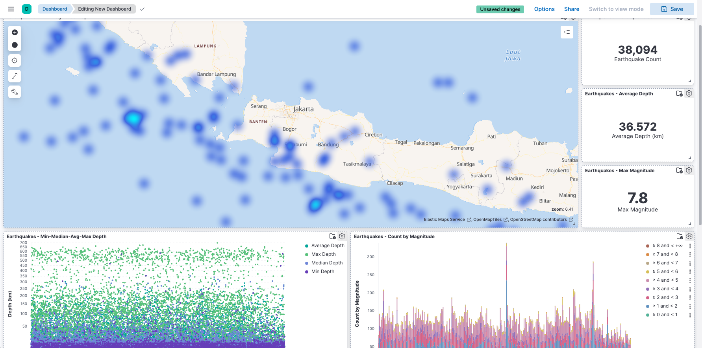
5. Save the created dashboard.
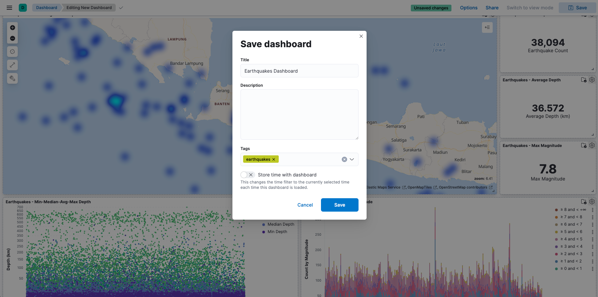

## Index Lifecycle Management
### Testing
### Quick steps for testing ILM in Index Management

#### Create Index Lifecycle Management
Example : 
```shell
PUT /_ilm/policy/full
{
  "policy": {
    "phases" : {
      "hot" : {
        "min_age" : "0ms",
        "actions" : {
          "rollover" : {
            "max_docs" : 1
          }
        }
      },
      "warm" : {
        "min_age" : "15s",
        "actions" : {
          "forcemerge" : {
            "max_num_segments" : 1
          },
          "shrink" : {
            "number_of_shards" : 1
          }
        }
      },
      "cold" : {
        "min_age" : "30s",
        "actions" : {
        }
      },
      "delete" : {
        "min_age" : "1d",
        "actions" : {
          "delete" : { }
        }
      }
    }
  }
}
```

#### Create Index Template
Example :
```shell
PUT _template/test
{
  "index_patterns": ["test-*"],
  "settings": {
    "number_of_shards": 3,
    "number_of_replicas": 0,
    "index.lifecycle.name": "full",
    "index.lifecycle.rollover_alias": "test-alias"
  }
}
```

#### Create Test Index
Example:
```shell
PUT /test-000001
{
  "aliases": {
    "test-alias": {
      "is_write_index": true
    }
  }
}
```

#### Put some document
Example :
```shell
PUT test-alias/_doc/1
{
  "a": "a"
}
```

#### Update ILM Poll Interval
```shell
PUT /_cluster/settings
{
  "transient": {
    "indices.lifecycle.poll_interval": "10s"
  }
}
```


